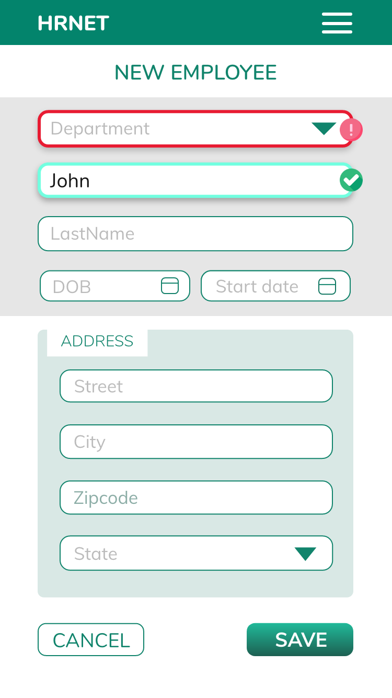
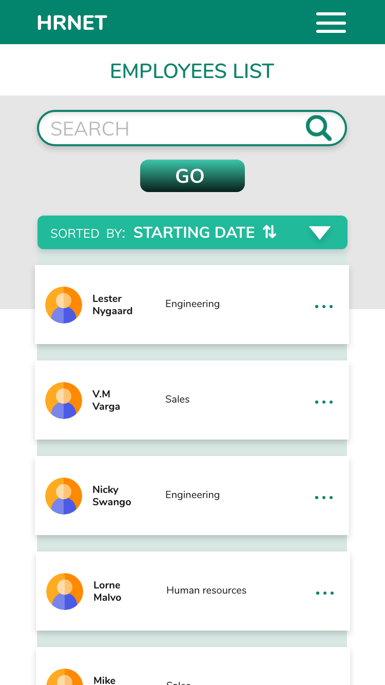

## HRnet : a company's internal application to create and view employee records
---

<p align="center">
    
  
</p>

### ▶︎ STACK
- HTML5/CSS3
- React / Redux
---

###  ▶︎ TOOLS
- MirageJs + FakerJs
- LightHouse
- Jest/Testing-library
- CI/CD: Circleci + Heroku

---
###  ▶︎ INSTALL

```bash
#clone repository to local folder
git clone https://github.com/GitHubAgneska/HRNET-app.git

#install dependencies
npm i

#run
npm run start
```

---
###  ▶︎ FURTHER INFO
- Fake backend / api:
    - By default, MirageJs is set up to generate a list of 100 employees to feed the datatable at https://localhost:3000/employees-list
    - to change the amount, go to:
        - src > api > server > line 138:
        ```bash
        seeds(server) { server.createList('employee', 100) ; }
        ```

- React Data table with sort / search / pagination is available as an NPM package
https://www.npmjs.com/package/react-datatable-search-pagination

---
###  ▶︎ Projects requirements & development process
=> hrnet dev [roadmap](roadmap.md)

---


